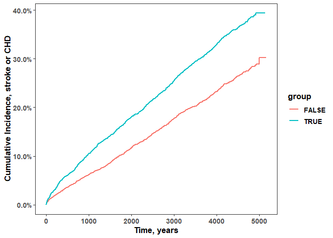

<!-- README.md is generated from README.Rmd. Please edit that file -->

#This is another line from RStudio


# cumulative-incidence

The goal of the cumulative-incidence project is to provide a tutorial
for JHS-HWG members who want to create cumulative incidence plots using
`ggplot2`. To demonstrate the code in this repository, we use the
`flchain` data from the `survival` package. These data are loaded and
printed here.

This is a stratified random sample containing 1/2 of the subjects from a
study of the relationship between serum free light chain (FLC) and
mortality. The original sample contains samples on approximately 2/3 of
the residents of Olmsted County aged 50 or greater.

``` r

# the flchain data are in the survival package
library(survival)
# tidyverse is used for convenience
library(tidyverse)

# take a look at the data, 
# each column is printed with a few values to the right of its column name
glimpse(flchain)
#> Rows: 7,874
#> Columns: 11
#> $ age        <dbl> 97, 92, 94, 92, 93, 90, 90, 90, 93, 91, 96, 90, 90, 97, ...
#> $ sex        <fct> F, F, F, F, F, F, F, F, F, F, F, F, F, F, F, F, F, F, F,...
#> $ sample.yr  <dbl> 1997, 2000, 1997, 1996, 1996, 1997, 1996, 1999, 1996, 19...
#> $ kappa      <dbl> 5.700, 0.870, 4.360, 2.420, 1.320, 2.010, 0.430, 2.470, ...
#> $ lambda     <dbl> 4.860, 0.683, 3.850, 2.220, 1.690, 1.860, 0.880, 2.700, ...
#> $ flc.grp    <dbl> 10, 1, 10, 9, 6, 9, 1, 10, 9, 6, 9, 10, 3, 10, 9, 6, 7, ...
#> $ creatinine <dbl> 1.7, 0.9, 1.4, 1.0, 1.1, 1.0, 0.8, 1.2, 1.2, 0.8, 1.3, 1...
#> $ mgus       <dbl> 0, 0, 0, 0, 0, 0, 0, 0, 0, 0, 0, 0, 0, 0, 0, 0, 0, 0, 0,...
#> $ futime     <int> 85, 1281, 69, 115, 1039, 1355, 2851, 372, 3309, 1326, 27...
#> $ death      <dbl> 1, 1, 1, 1, 1, 1, 1, 1, 1, 1, 1, 1, 1, 1, 1, 1, 1, 1, 1,...
#> $ chapter    <fct> Circulatory, Neoplasms, Circulatory, Circulatory, Circul...
```

# Create cumulative incidence data

The `cuminc()` function in the `cmprsk` package can generate data on the
cumulative incidence of a censored outcome, accounting for competing
risks if necessary.

``` r

# loading the cmprsk package to gain access to cuminc() function
library(cmprsk)

cml_inc = cuminc(
 # the first argument is the failure times, i.e., the time to event variable
 ftime   = flchain$futime, 
 # the second argument is the status variable (1 = event, 0 = censored)
 # (if you have competing risks, you will have values of 1, 2, 3, ... etc 
 #  for the different event types)
 fstatus = flchain$death,
 # the third argument is the group variable, which will be used to create 
 # one cumulative incidence curve per group.
 group   = flchain$creatinine > 1
)
#> 1350 cases omitted due to missing values
```

Note here that we have 1350 observations as they had missing values for
`creatinine`. You should be aware of this mechanic in case you have
missing values in your grouping variable.

Next we use the `ggcompetingrisks` package to create a dataset with
cumulative incidence estimates. `ggcompetingrisks` also makes plots, but
they are a little harder to customize than a standard `ggplot2` plot.

``` r

# load the survminer package to gain access to the
# ggcompetingrisks function 
library(survminer)
#> Warning: package 'survminer' was built under R version 4.0.3
#> Loading required package: ggpubr
#> Warning: package 'ggpubr' was built under R version 4.0.3

ggdat <- cml_inc %>%
  ggcompetingrisks(conf.int = T) %>%
  getElement('data') %>%
  as_tibble() %>%
  select(
    time,
    group, # same group as in cuminc(),
    est, # est is cumulative incidence,
    std # std is the standard deviation of est
  )

print(ggdat)
#> # A tibble: 3,538 x 4
#>     time group      est      std
#>    <dbl> <chr>    <dbl>    <dbl>
#>  1     0 FALSE 0        0       
#>  2     1 FALSE 0        0       
#>  3     1 FALSE 0.000873 0.000504
#>  4     2 FALSE 0.000873 0.000504
#>  5     2 FALSE 0.00116  0.000582
#>  6     3 FALSE 0.00116  0.000582
#>  7     3 FALSE 0.00175  0.000713
#>  8     4 FALSE 0.00175  0.000713
#>  9     4 FALSE 0.00204  0.000770
#> 10     6 FALSE 0.00204  0.000770
#> # ... with 3,528 more rows
```

# one figure, two groups, no standard errors

This code will generate a figure that directly compares the incidence of
an event between two or more groups. The code utilizes the data that we
created using `cuminc()` above.

``` r

ggplot(ggdat, aes(x = time, y = est, col = group))+
 geom_line(size=0.9)+
 # This is a theme that is consistent with many journals expectations
 # for figures
 theme_bw()+
 theme(
  panel.grid = element_blank(),
  text = element_text(size = 13, color = 'black', face = 'bold')
 ) +
 scale_y_continuous(label=scales::percent) +
 labs(x='Time, years', y = 'Cumulative Incidence, stroke or CHD')
```

<!-- -->
